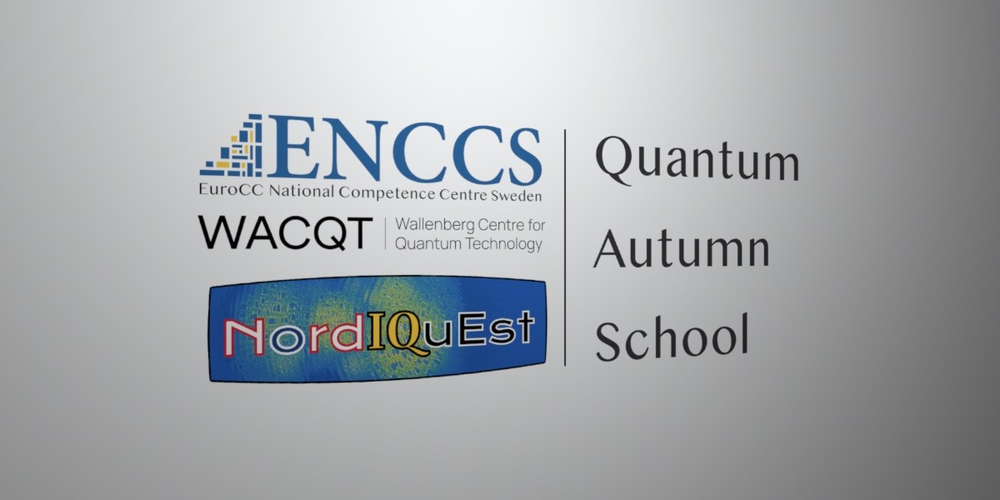

## Table of Contents
1. [Description](#description)
2. [Information](#information)
3. [Certificate](#certificate)

## Description

Recent developments in quantum technology are bringing the world closer to a new technological revolution – the advent of usable quantum computers able to provide enormous acceleration to important computational tasks. In the coming years, quantum computing is expected to have a significant impact on many areas of research that can utilize computational modeling. 
Indeed, significant efforts and investments are currently underway in Europe to [bolster skills and capacity within quantum computing](https://enccs.se/news/2023/06/european-hpc-quantum-computing-infrastructure/).

ENCCS is again joining forces with the [Wallenberg Centre of Quantum Technologies (WACQT)](https://www.chalmers.se/en/centres/wacqt/) and the [Nordic/Baltic NordIQuEst](https://nordiquest.net/) project to deliver a three-day autumn school covering the fundamentals of quantum computing. The school will also be visited by and contributed to by [Algorithmiq](https://algorithmiq.fi/), a Finnish startup which aims to revolutionize life sciences by exploiting the potential of quantum computing to solve currently inaccessible problems.

WACQT is a national research programme, coordinated by Chalmers, that aims to take Swedish research and industry to the forefront of quantum technology. The main project of WACQT is to develop a high-end quantum computer that can solve problems far beyond the reach of the best conventional supercomputers.

NordΙQuEst brings together a consortium of seven partners from five Nordic and Baltic countries to connect world-leading traditional HPC resources and quantum computers across national borders with the aim to establish a quantum computing platform customized to the needs of the region.

The school will cover: 

> - Introduction to key concepts: quantum states, qubits, quantum algorithms;
> - Overview of the main QC hardware approaches; 
> - Overview of the QC software stack;
> - Integration of QC with classical computing: hybrid classical/quantum algorithms and HPC-QC systems;
> - QC programming in high-level languages for use cases in optimization, finance, life science, and quantum chemistry;
> - Morning lectures will be combined with afternoon hands-on sessions where participants learn to use high-level QC programming languages.

Participants in the school will be given direct access to Helmi, a 5-qubit quantum computer using superconducting qubits that is connected to LUMI, the most powerful supercomputer in Europe.

## Information

The topics covered in this course, divided by day, were the following:

Day 1:
- Physical Approaches to Quantum Computing;
- Introduction to Digital Quantum Computing;
- Tutorial - Quantum programming I;
- Tutorial - Quantum programming II;
- Tutorial - Quantum programming III.

Day 2:
- HPC-QC integration;
- QC software stack;
- Hybrid Classical/Quantum Algorithms;
- Tutorial - Introduction to Helmi with qiskit;
- Tutorial - Qubit Spectroscopy Analysis;
- Tutorial - Quantum Alternating Operator Ansatz.

Day 3:
- Hybrid Algorithms - Use Cases for Quantum Chemistry;
- Hybrid Algorithms - Use Cases for Quantum Finance;
- Hybrid Algorithms - Use Cases for Quantum Life Science;
- Tutorial - Quantum chemistry;
- Tutorial - State generation;
- Tutorial - Quantum support vector regression for disability insurance;
- Tutorial - Protein Folding with QAOA.

All necessary information, links, and content for the course can be found on the [course website](https://enccs.github.io/qas2023/).

## Certificate

The certificate for the course can be found below:

- ["Quantum Autumn School" - ENCCS, Wallenberg Centre of Quantum Technologies (WACQT), Nordic/Baltic NordIQuEst](https://github.com/HROlive/Quantum-Autumn-School/blob/main/images/certificate.pdf) (Issued On: October 2023)
